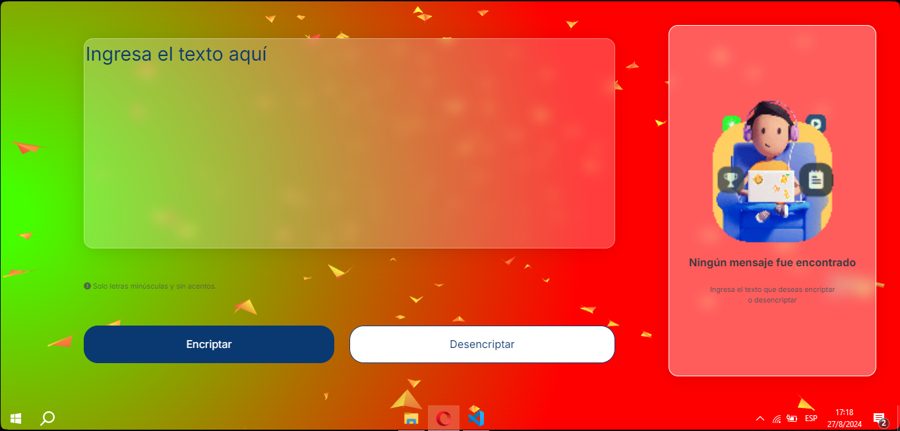

# 🔒 Encriptador de Texto 🔐

## ¡Bienvenido a mi Proyecto **Encriptador de Texto**! 🌟

Este proyecto, hecho por **Pablo Fernández Aduviri** como parte del desafío del programa **ONE**, es una aplicación web desarrollada con **HTML**, **CSS** y **JavaScript**. El objetivo es ofrecer una herramienta sencilla, visualmente atractiva y funcional para **encriptar** y **desencriptar** texto, cumpliendo con las expectativas del programa y demostrando mis habilidades en desarrollo web. ¡Espero que este proyecto refleje mi compromiso y pasión por la tecnología! 🌟

## 🛠️ Tecnologías Utilizadas

- **HTML5**: Estructura de la aplicación.
- **CSS3**: Estilos y diseño.
- **JavaScript**: Lógica para la encriptación y desencriptación.
- **[Squoosh](https://squoosh.app/)**: Herramienta web que permite comprimir y optimizar imágenes de manera rápida y eficaz, manteniendo alta calidad y reduciendo el tamaño de los archivos. Fue utilizada para optimizar las imágenes del proyecto y mejorar el rendimiento de la aplicación.
- **[Vanta.js](https://www.vantajs.com/)**: Biblioteca JavaScript que permite agregar efectos visuales animados en el fondo de páginas web de manera sencilla y con bajo consumo de recursos. Utilizada en este proyecto para enriquecer la experiencia visual del usuario con animaciones de fondo interactivas y atractivas.


## 📸 Capturas de Pantalla

### Interfaz


## 🖥️ Uso

1. Clona el repositorio:

    ```bash
    git clone https://github.com/Seibans/challenge-oracle-pablo
    ```

2. Abre `index.html` en tu navegador:

    ```bash
    open index.html
    ```

3. ¡Empieza a encriptar y desencriptar tus mensajes!

## 🧠 Inspiración del Proyecto

Este proyecto nació de mi pasión por aprender y explorar nuevas tecnologías, combinado con la necesidad de garantizar la **seguridad en la comunicación**. Fue creado como parte del **challenge del programa ONE de Alura**, un desafío que no solo puso a prueba mis habilidades técnicas, sino también mi creatividad e ingenio. ✨

Cada línea de código en este proyecto refleja mi deseo de crecer profesionalmente y mi compromiso con la excelencia. Me emociona la posibilidad de unirme al programa de Alura, donde podré continuar mi viaje de aprendizaje y compartir mi pasión con una comunidad vibrante y en constante evolución. Este proyecto es más que una simple herramienta de encriptación; es un reflejo de mi determinación por aprender y mejorar cada día.

---

## 🤝 Contribuciones

¡Tu participación es bienvenida! Si tienes ideas para mejorar este proyecto o deseas agregar nuevas funcionalidades, no dudes en enviar un pull request o abrir un issue. **Juntos, podemos hacer que esta herramienta sea aún mejor.** 🚀🙌

---

## 📜 Licencia

Este proyecto está disponible bajo la **Licencia MIT**. Puedes consultar el archivo `LICENSE` para obtener más detalles. 📄

---

## 🎉 ¡Gracias!

¡Gracias por tomarte el tiempo de revisar el proyecto **Encriptador de Texto**! Este es solo el comienzo de lo que espero sea un camino lleno de aprendizajes y logros dentro del programa de Alura. Si te ha gustado, te agradecería que le dieras una ⭐ en GitHub.

---

**Saludos cordiales y con mucha ilusión,**

**Pablo Fernandez Aduviri** 🎓✨

---

*¡Espero que este proyecto inspire tanto como me ha inspirado a mí crearlo!* 😄
